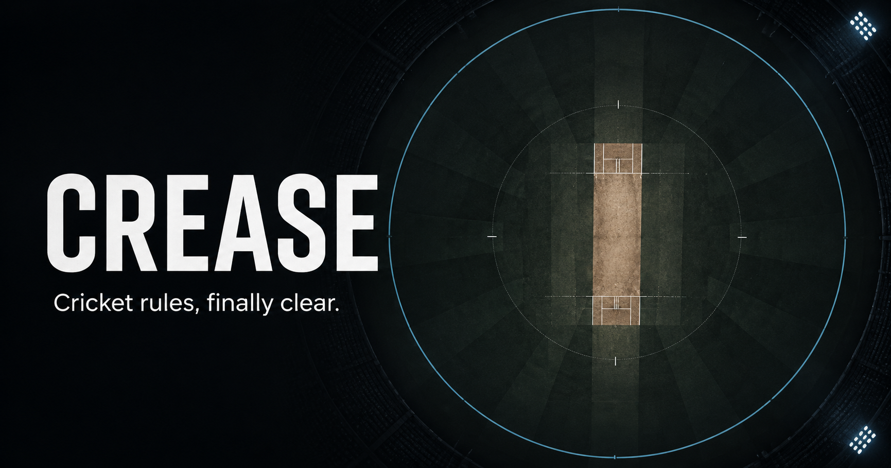

# Crease

An interactive, animated introduction to cricket for people learning the game
for the first time.



Crease explains the basics one step at a time, using a visual cricket ground
instead of a wall of rules. The lesson covers:

- the ground, boundary, pitch, wickets, and creases
- teams, the toss, and player roles
- batting, bowling, and fielding
- runs, boundaries, and extras
- common dismissals
- overs and score notation

## Run locally

### Prerequisites

- Node.js 22.13 or newer
- npm

Install the dependencies and start the development server:

```bash
npm ci
npm run dev
```

Open the local URL printed in the terminal. The development server supports hot
reloading.

## Commands

| Command | Description |
| --- | --- |
| `npm run dev` | Start the local development server |
| `npm run build` | Create a production build |
| `npm start` | Serve the production build |
| `npm test` | Build and verify the server-rendered lesson |
| `npm run lint` | Run ESLint |
| `npm run typecheck` | Check TypeScript types |

## Project structure

```text
app/
  page.tsx          Lesson layout and controls
  lesson-content.ts Lesson copy and field positions
  use-lesson-navigation.ts Shared button and keyboard navigation
  use-lesson-animation.ts Animation lifecycle and sequences
  globals.css       Layout, responsive styles, and visual design
  layout.tsx        Page metadata and root layout
public/
  og.png            Social preview image
tests/
  rendered-html.test.mjs
worker/
  index.ts          Cloudflare Worker entry point
```

The app is built with React, TypeScript, [vinext](https://github.com/cloudflare/vinext),
and [Anime.js](https://animejs.com/). It runs on a Cloudflare Worker through the
Cloudflare Vite plugin and is configured for OpenAI Sites in
`.openai/hosting.json`.

## Data bindings

Crease does not require a database, object storage, or application sign-in. The
D1 and R2 bindings in `.openai/hosting.json` are unset.

## Accessibility

The lesson supports keyboard navigation, exposes its controls and diagrams with
accessible labels, and disables motion-heavy transitions when the operating
system's reduced-motion preference is enabled.
